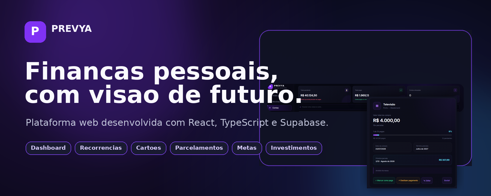
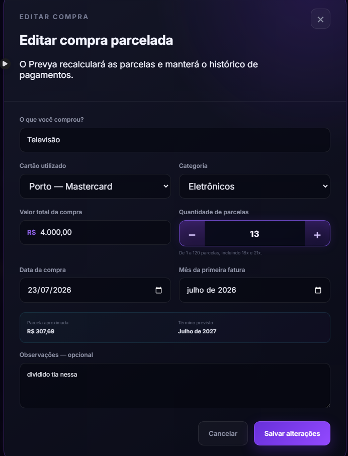

<p align="center">
  
</p>

# Prevya

**Plataforma web de organização financeira pessoal, desenvolvida do zero como produto digital.**

O Prevya centraliza movimentações, contas, cartões, compras parceladas, metas e investimentos em uma experiência visual única. O projeto nasceu para transformar dados financeiros dispersos em uma visão simples, antecipada e acionável.

> Este é um repositório público de apresentação. O código-fonte, as migrations completas e as regras comerciais permanecem em um repositório privado.

## Visão do produto

O sistema foi projetado para responder perguntas práticas do dia a dia:

- Quanto entrou, quanto saiu e qual foi o resultado do mês?
- Quais contas e faturas estão próximas do vencimento?
- Quanto do limite dos cartões já está comprometido?
- Quantas parcelas ainda faltam e quando a compra termina?
- Quanto já foi guardado para cada objetivo?
- Quanto foi investido e qual é o rendimento atual?

## Principais funcionalidades

### Dashboard financeiro

- Resumo mensal de receitas, despesas e saldo.
- Comparativo dos últimos meses.
- Patrimônio investido e progresso das metas.
- Alertas de vencimento e pendências de meses anteriores.

<p align="center">
  
</p>

### Movimentações

- Cadastro de receitas e despesas.
- Edição e exclusão de lançamentos.
- Movimentações recorrentes com escopo por ocorrência ou série.
- Associação de despesas a saldo, dinheiro ou cartão.

### Contas a pagar

- Organização por mês de referência e vencimento.
- Status pendente, paga, próxima do vencimento ou atrasada.
- Contas recorrentes e exceções de recorrência.
- Registro automático da despesa ao marcar uma conta como paga.

### Cartões e faturas

- Cadastro de cartão, banco, apelido, limite, fechamento e vencimento.
- Cálculo de fatura por competência.
- Limite disponível e valor comprometido.
- Pagamento e reabertura de fatura.

### Compras parceladas

- Compra vinculada a cartão e categoria.
- Distribuição automática das parcelas por mês.
- Acompanhamento do total pago, pendente e percentual concluído.
- Edição com recálculo das parcelas e preservação do histórico de pagamentos.
- Marcação individual de parcela como paga ou pendente.

<p align="center">
  
  &nbsp;&nbsp;
  
</p>

### Metas financeiras

- Metas por categoria, valor e prazo.
- Registro de adições e retiradas.
- Progresso percentual e valor restante.
- Sugestão mensal para atingir o objetivo no prazo.

### Investimentos

- Controle manual de aplicações por instituição e tipo.
- Valor inicial, saldo atual, aportes e histórico.
- Cálculo de rendimento nominal e percentual.
- Exclusão de aportes com recálculo do saldo.

### Conta e preferências

- Autenticação por e-mail e senha.
- Recuperação de senha.
- Dados separados por usuário.
- Idioma em português ou inglês.
- Moedas BRL, USD, CAD, EUR e GBP.
- Sincronização das preferências na nuvem.

## Arquitetura

```text
React + TypeScript + Vite
          |
          v
Hooks de domínio e componentes de interface
          |
          v
Supabase Auth + PostgreSQL + Row Level Security
```

O frontend foi organizado em componentes por domínio e hooks responsáveis por persistência, regras de negócio e sincronização. O Supabase concentra autenticação, banco PostgreSQL, funções transacionais e políticas de segurança por usuário.

## Stack técnica

- **Frontend:** React 19, TypeScript e Vite.
- **Backend as a Service:** Supabase.
- **Banco:** PostgreSQL.
- **Autenticação:** Supabase Auth.
- **Segurança:** Row Level Security e separação por `user_id`.
- **Qualidade:** TypeScript build, Oxlint e Git.
- **Interface:** CSS responsivo com identidade visual própria.

## Decisões de engenharia

- Migração gradual de dados locais para o Supabase.
- Controle explícito de séries recorrentes e exceções.
- Operações relacionadas protegidas contra inconsistências.
- Cálculos financeiros derivados dos registros reais, sem valores fixos.
- Internacionalização aplicada a textos, datas e moedas.
- Código dividido por domínio para facilitar manutenção e evolução.

## Desafios resolvidos

- Geração e edição de recorrências mensais.
- Preservação do histórico ao recalcular compras parceladas.
- Sincronização entre contas pagas e movimentações.
- Cálculo de fatura, limite disponível e parcelas futuras.
- Migração de dados do navegador para um banco multiusuário.
- Tratamento de datas e competências sem deslocamentos indevidos de fuso horário.

## Próxima evolução do produto

O roadmap comercial prevê três formas de acesso:

- **Admin:** acesso integral e vitalício, com painel administrativo.
- **Cortesia:** acesso vitalício concedido manualmente.
- **Assinante:** 14 dias de teste e assinatura mensal após o período gratuito.

Também estão planejados painel administrativo, integração de pagamentos, indicadores de uso, exportação completa de dados e publicação da aplicação em ambiente de produção.

## Documento completo

A apresentação visual detalhada está disponível em:

**[Prevya - Portfolio do Projeto](docs/Prevya-Portfolio.pdf)**

## Autor

**Victor Vinny Braz**  
Profissional de Dados, BI e desenvolvimento de soluções analíticas.  
GitHub: `VictorVInny`

---

© 2026 Victor Vinny Braz. Todos os direitos reservados. Este repositório apresenta o produto e não concede licença de uso, cópia, modificação ou distribuição do código-fonte privado.
